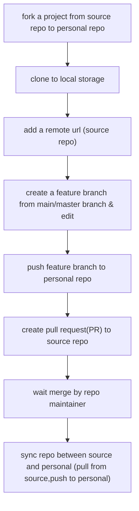

# github-tes

## Articles

- GitHub Flow

- Using Branches and Pull Requests with the Clubhouse VCS Integrations
  - [https://help.clubhouse.io/hc/en-us/articles/207540323-Using-Branches-and-Pull-Requests-with-the-Clubhouse-VCS-Integrations][1]
- GitHub Actions get started:
  - [實作開源小工具，與 Github Actions 的第一次相遇！][0]

---
[comment]: <> (references)
[0]:https://medium.com/starbugs/%E5%AF%A6%E4%BD%9C%E9%96%8B%E6%BA%90%E5%B0%8F%E5%B7%A5%E5%85%B7-%E8%88%87-github-actions-%E7%9A%84%E7%AC%AC%E4%B8%80%E6%AC%A1%E7%9B%B8%E9%81%87-3dd2d70eeb
[1]:https://help.clubhouse.io/hc/en-us/articles/207540323-Using-Branches-and-Pull-Requests-with-the-Clubhouse-VCS-Integrations
